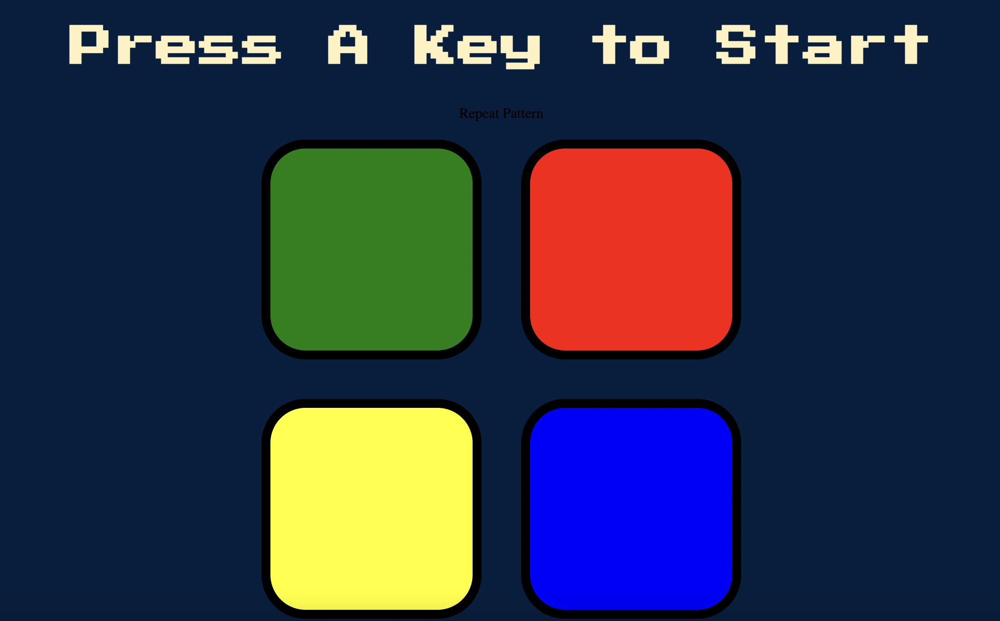
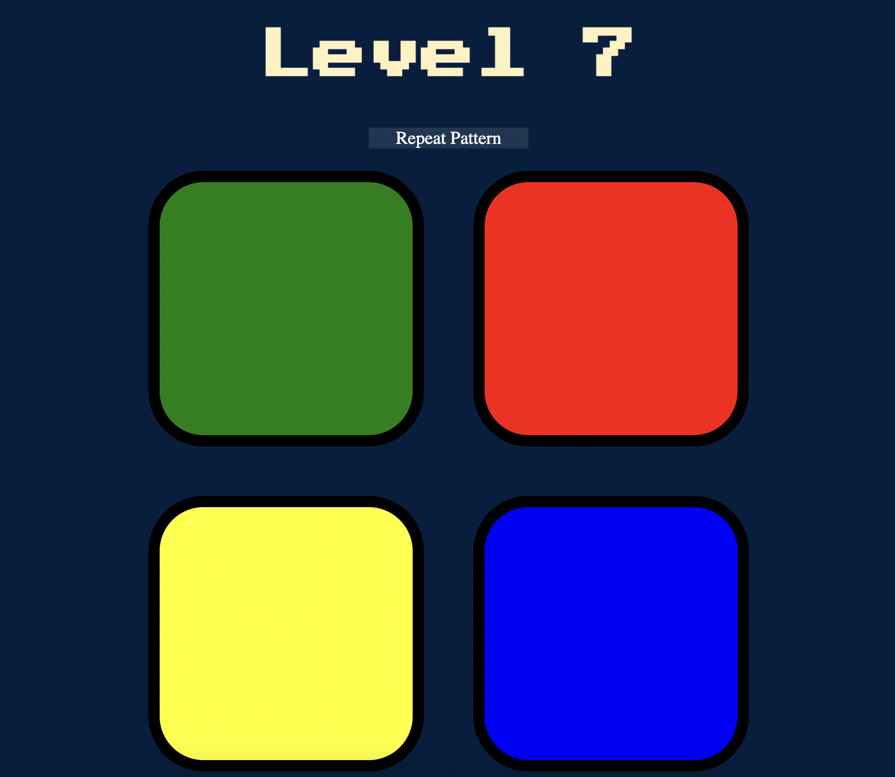

# Simon Game 🕹📍

&nbsp;&nbsp;&nbsp;&nbsp; The Simon Game is an exciting memory-intensive game in which players must correctly replicate a sequence of colors generated randomly by the computer back to it in the right order. It is a fast-paced interactive game that challenges your brain and your memorization skills.
The game is played using four colored buttons (red, yellow, blue, green) whose unique sequence generated by the computer the person must match EXACTLY.

### How do you play the game?

&nbsp;&nbsp;&nbsp;&nbsp;  To game flow goes as follows: Firstly, the user should randomly press a key to start the game. The computer will then highlight a color which the player must click on to advance to the next level. In the next level, the computer will highlight another color. The player must now, remeber the previous color as well as the new one and click on the previous buttons and new one respectively. 
For example, 
1. Level 1: Computer indicated BLUE. 
2. Level 2: Computer indicated BLUE. 
3. Level 3: Computer indicated GREEN.
4. Level 4: Computer indicated RED.

Then at level 4, player must press BLUE, then BLUE, then GREEN, and then RED respectively. On correct pattern click, the computer will move on to the next level. 

**IMPORTANT**:
Players need to  remember the color pattern and repeat it by pressing the colored buttons on the game unit in the correct order. It starts off at relatively simple, but as the levels increase, the pattern becomes more complicated to memorize and correctly reproduce.

If the wrong pattern is clicked, the game will be over and the user must press a random key to start over. IF YOU FORGET THE PATTERN, a button called "Repeat Pattern" is available that will repeat the pattern again to you, but use this only when necessary.

## Deployment

Interact with Simon Game website here --> Demo: [Simon Game Website](https://rahuls1428.github.io/Simon-Game/)

## Built With

  * HTML
  * CSS
  * JavaScript - and its shortcut "jQuery"

## Authors

  * **Rahul Solaiappan**

## Acknowledgments

  * The Complete Web Development Bootcamp by Angela Yu
